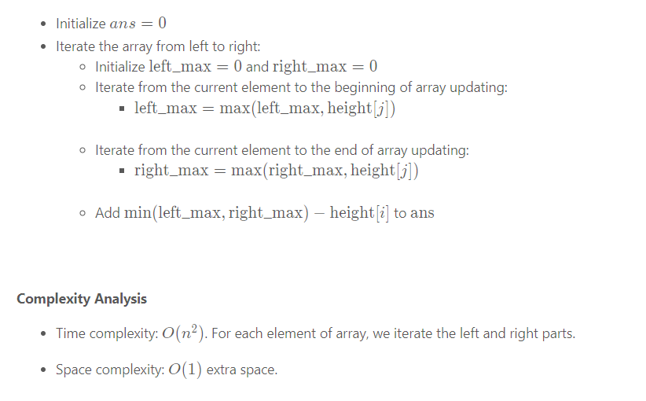
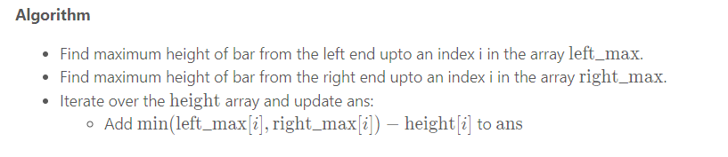
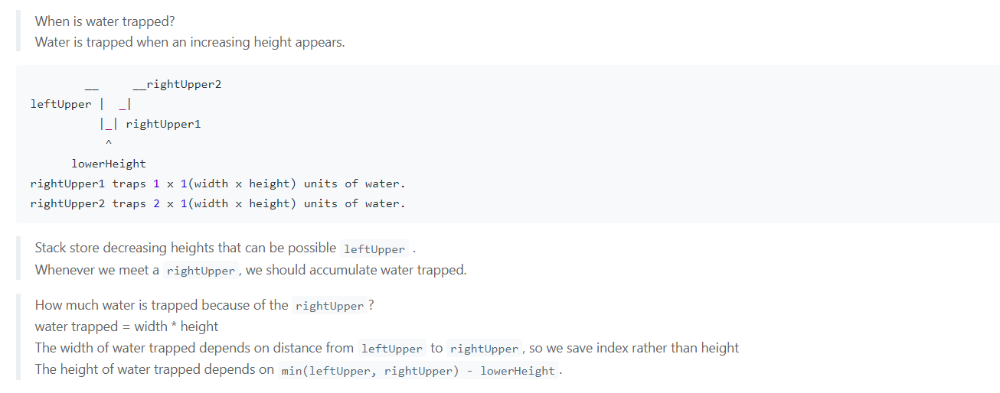

# [42. Trapping Rain Water](https://leetcode.com/problems/trapping-rain-water)

## Description

<p>Given <code>n</code> non-negative integers representing an elevation map where the width of each bar is <code>1</code>, compute how much water it can trap after raining.</p>

<p>&nbsp;</p>
<p><strong>Example 1:</strong></p>

<pre>
<strong>Input:</strong> height = [0,1,0,2,1,0,1,3,2,1,2,1]
<strong>Output:</strong> 6
<strong>Explanation:</strong> The above elevation map (black section) is represented by array [0,1,0,2,1,0,1,3,2,1,2,1]. In this case, 6 units of rain water (blue section) are being trapped.
</pre>

<p><strong>Example 2:</strong></p>

<pre>
<strong>Input:</strong> height = [4,2,0,3,2,5]
<strong>Output:</strong> 9
</pre>

<p>&nbsp;</p>
<p><strong>Constraints:</strong></p>

<ul>
	<li><code>n == height.length</code></li>
	<li><code>1 &lt;= n &lt;= 2 * 10<sup>4</sup></code></li>
	<li><code>0 &lt;= height[i] &lt;= 10<sup>5</sup></code></li>
</ul>


## Solutions

<!-- tabs:start -->

### Solution 1 Brute force

### **Java**
```java
class Solution {
    public int trap(int[] height) {
        int res = 0;
        for (int i = 1; i < height.length - 1; i++) {
            int MaxLeft = 0, MaxRight = 0;
            for (int l = i; l >= 0; l--) {
                MaxLeft = Math.max(MaxLeft, height[l]);
            }

            for (int r = i; r < height.length; r++) {
                MaxRight = Math.max(MaxRight, height[r]);
            }
            res += Math.min(MaxLeft, MaxRight) - height[i];
        }
        return res;
    }
}
```
### Solution 2 DP

```java
class Solution {
    public int trap(int[] height) {
        int res = 0, max = 0;
        int[] dp = new int[height.length];
        for (int i = 0; i < height.length; i++) {
            max = Math.max(height[i], max);
            dp[i] = max;
        }
        max = 0;
        for (int i = height.length - 1; i >= 0; i--) {
            max = Math.max(height[i], max);
            res += Math.min(dp[i], max) - height[i];
        }
        return res;
    }
}
```
### Solution 3 Stack

```java
class Solution {
    public int trap(int[] height) {
        if (height == null || height.length < 2) return 0;
        Deque<Integer> dq = new ArrayDeque<>();
        int res = 0;
        for (int i = 0; i < height.length; i++) {
            while (!dq.isEmpty() && height[dq.peek()] < height[i]) {
                int topIndex = dq.pop();
                if (dq.isEmpty()) {
                    break;
                }
                int left = dq.peek();
                int dist = Math.min(height[left], height[i]) - height[topIndex];
                res += dist * (i - left - 1);
            }
            dq.push(i);
        }
        return res;
    }
}
```
### Solution 4 2 pointers
```java
class Solution {
    public int trap(int[] height) {
        int left = 0, right = height.length - 1, res = 0;
        int leftMax = 0, rightMax = 0;
        // Water could, potentially, fill everything from left to right, if there is nothing in between.
        while (left < right) {
            // a taller bar exists on left pointer's right side(height[leftMax] must less than height[right])
            if (height[left] < height[right]) {
                if (height[left] < leftMax) {
                    res += leftMax - height[left];
                } else {
                    leftMax = height[left];
                }
                left++;
                // a taller bar exists on right pointer's left side
            } else {
                if (height[right] < rightMax) {
                    res += rightMax - height[right];
                } else {
                    rightMax = height[right];
                }
                right--;
            }
        }
        return res;
    }
}
```
### **...**

```

```

<!-- tabs:end -->