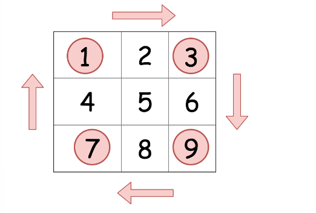

# [48. Rotate Image](https://leetcode.com/problems/rotate-image)

## Description

<p>You are given an <code>n x n</code> 2D <code>matrix</code> representing an image, rotate the image by <strong>90</strong> degrees (clockwise).</p>

<p>You have to rotate the image <a href="https://en.wikipedia.org/wiki/In-place_algorithm" target="_blank"><strong>in-place</strong></a>, which means you have to modify the input 2D matrix directly. <strong>DO NOT</strong> allocate another 2D matrix and do the rotation.</p>

<p>&nbsp;</p>
<p><strong>Example 1:</strong></p>

<pre>
<strong>Input:</strong> matrix = [[1,2,3],[4,5,6],[7,8,9]]
<strong>Output:</strong> [[7,4,1],[8,5,2],[9,6,3]]
</pre>

<p><strong>Example 2:</strong></p>

<pre>
<strong>Input:</strong> matrix = [[5,1,9,11],[2,4,8,10],[13,3,6,7],[15,14,12,16]]
<strong>Output:</strong> [[15,13,2,5],[14,3,4,1],[12,6,8,9],[16,7,10,11]]
</pre>

<p>&nbsp;</p>
<p><strong>Constraints:</strong></p>

<ul>
	<li><code>n == matrix.length == matrix[i].length</code></li>
	<li><code>1 &lt;= n &lt;= 20</code></li>
	<li><code>-1000 &lt;= matrix[i][j] &lt;= 1000</code></li>
</ul>


## Solutions

<!-- tabs:start -->
本题有两种解法，都是根据矩阵本身的性质来进行操作
### Solution1
观察矩阵本身，我们可以移动矩阵的四分之一



### **Java**

```java
class Solution {
    public void rotate(int[][] matrix) {
        if (matrix == null || matrix.length == 0) {
            return;
        }
        int m = matrix.length;

        for (int i = 0; i <  m / 2; i++) {
            for (int j = 0; j < (m + 1)/ 2; j++) {
                int temp = matrix[i][j];
                matrix[i][j] = matrix[m - j - 1][i];
                matrix[m - j - 1][i] = matrix[m - i - 1][m - j - 1];
                matrix[m - i - 1][m - j - 1] = matrix[j][m - i - 1];
                matrix[j][m - i - 1] = temp;
            }
        }
    }
}
```
复杂度分析
时间复杂度: O(n)
空间复杂度: O(1) 没有用到额外空间


### Solution2
先把把矩阵对角翻转，再左右翻转， 

### **Java**

```java
class Solution {
    public void rotate(int[][] matrix) {
        if (matrix == null || matrix.length == 0) {
            return;
        }
        int n = matrix.length;
        for (int i = 0; i < n; i++) {
            for (int j = i + 1; j < n; j++) {
                int temp = matrix[i][j];
                matrix[i][j] = matrix[j][i];
                matrix[j][i] = temp;
            }
        }


        for (int i = 0; i < n; i++) {
            for (int j = 0; j < n / 2; j++) {
                int temp = matrix[i][j];
                matrix[i][j] = matrix[i][n - j - 1];
                matrix[i][n - j - 1] = temp;
            }
        }
    }
}
```
复杂度
时间复杂度: O(n) (其实是2n， 用了两倍的计算次数)
空间复杂度: O(1) 没有用到额外空间

### **...**

```

```

<!-- tabs:end -->