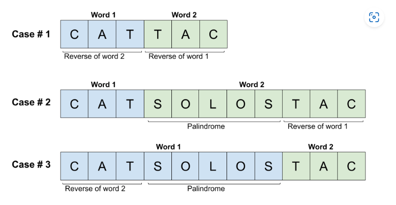

# [336. Palindrome Pairs](https://leetcode.com/problems/palindrome-pairs)

## Description

<p>Given a list of <b>unique</b> words, return all the pairs of the&nbsp;<b><i>distinct</i></b> indices <code>(i, j)</code> in the given list, so that the concatenation of the two words&nbsp;<code>words[i] + words[j]</code> is a palindrome.</p>

<p>&nbsp;</p>
<p><strong>Example 1:</strong></p>

<pre>
<strong>Input:</strong> words = [&quot;abcd&quot;,&quot;dcba&quot;,&quot;lls&quot;,&quot;s&quot;,&quot;sssll&quot;]
<strong>Output:</strong> [[0,1],[1,0],[3,2],[2,4]]
<strong>Explanation:</strong> The palindromes are [&quot;dcbaabcd&quot;,&quot;abcddcba&quot;,&quot;slls&quot;,&quot;llssssll&quot;]
</pre>

<p><strong>Example 2:</strong></p>

<pre>
<strong>Input:</strong> words = [&quot;bat&quot;,&quot;tab&quot;,&quot;cat&quot;]
<strong>Output:</strong> [[0,1],[1,0]]
<strong>Explanation:</strong> The palindromes are [&quot;battab&quot;,&quot;tabbat&quot;]
</pre>

<p><strong>Example 3:</strong></p>

<pre>
<strong>Input:</strong> words = [&quot;a&quot;,&quot;&quot;]
<strong>Output:</strong> [[0,1],[1,0]]
</pre>

<p>&nbsp;</p>
<p><strong>Constraints:</strong></p>

<ul>
	<li><code>1 &lt;= words.length &lt;= 5000</code></li>
	<li><code>0 &lt;= words[i].length &lt;= 300</code></li>
	<li><code>words[i]</code> consists of lower-case English letters.</li>
</ul>


## Solutions

<!-- tabs:start -->

### Solution1 Brute Force 

### **Java**

```java
class Solution {
    // Brute Force
    public List<List<Integer>> palindromePairs(String[] words) {
        List<List<Integer>> pairs = new ArrayList<>();

        for (int i = 0; i < words.length; i++) {
            for (int j = 0; j < words.length; j++) {
                if (i == j) continue;
                String combined = words[i].concat(words[j]);
                String reversed = new StringBuilder(combined).reverse().toString();
                if (combined.equals(reversed)) {
                    pairs.add(Arrays.asList(i, j));
                }
            }   
        }

        return pairs;    
    }
}
```
### Solution 2 HashMap

```java
class Solution {
        /*
    Case1: If s1 is a blank string, then for any string that is palindrome s2, s1+s2 and s2+s1 are palindrome.
    Case 2: If s2 is the reversing string of s1, then s1+s2 and s2+s1 are palindrome.
    Case 3: If s1[0:cut] is palindrome and there exists s2 is the reversing string of s1[cut+1:] , then s2+s1 is palindrome.
    Case 4: Similar to case3. If s1[cut+1: ] is palindrome and there exists s2 is the reversing string of s1[0:cut] , then s1+s2 is palindrome.
    To make the search faster, build a HashMap to store the String-idx pairs.
    */
    public List<List<Integer>> palindromePairs(String[] words) {
        List<List<Integer>> res = new ArrayList<List<Integer>>();
        if (words == null || words.length == 0) {
            return res;
        }
        //build the map save the key-val pairs: String - idx
        Map<String, Integer> map = new HashMap<>();
        for (int i = 0; i < words.length; i++) {
            map.put(words[i], i);
        }

        //special cases: "" can be combined with any palindrome string
        if (map.containsKey("")) {
            int blankIdx = map.get("");
            for (int i = 0; i < words.length; i++) {
                if (isPalindrome(words[i])) {
                    if (i == blankIdx) continue;
                    res.add(Arrays.asList(blankIdx, i));
                    res.add(Arrays.asList(i, blankIdx));
                }
            }
        }

        //find all string and reverse string pairs
        for (int i = 0; i < words.length; i++) {
            String cur_r = reverseStr(words[i]);
            if (map.containsKey(cur_r)) {
                int found = map.get(cur_r);
                if (found == i) continue;
                res.add(Arrays.asList(i, found));
            }
        }

        //find the pair s1, s2 that
        //case1 : s1[0:cut] is palindrome and s1[cut+1:] = reverse(s2) => (s2, s1)
        //case2 : s1[cut+1:] is palindrome and s1[0:cut] = reverse(s2) => (s1, s2)
        for (int i = 0; i < words.length; i++) {
            String cur = words[i];
            for (int cut = 1; cut < cur.length(); cut++) {
                if (isPalindrome(cur.substring(0, cut))) {
                    String cut_r = reverseStr(cur.substring(cut));
                    if (map.containsKey(cut_r)) {
                        int found = map.get(cut_r);
                        if (found == i) continue;
                        res.add(Arrays.asList(found, i));
                    }
                }
                if (isPalindrome(cur.substring(cut))) {
                    String cut_r = reverseStr(cur.substring(0, cut));
                    if (map.containsKey(cut_r)) {
                        int found = map.get(cut_r);
                        if (found == i) continue;
                        res.add(Arrays.asList(i, found));
                    }
                }
            }
        }

        return res; 
    }
    
    public String reverseStr(String str) {
        StringBuilder sb = new StringBuilder(str);
        return sb.reverse().toString();
    }

    public boolean isPalindrome(String s) {
        int i = 0;
        int j = s.length() - 1;
        while (i <= j) {
            if (s.charAt(i) != s.charAt(j)) {
                return false;
            }
            i++;
            j--;
        }
        return true;
    }
}
```
### Solution 2 -2 改进版 hashmap
这个做法融合前面的做法，把所有的corner case 都考虑到了
有以下几个corner case
- case1 一个字符串和另一个字符串的palindrome相同，在第一个循环中已经被处理了，所以第二个循环中用小于号略过这种情况
- case2 words 中有空字符串，两个循环中，第一个循环查的是prefix的palindrome， 然后查是否后半段在map中，当cut=cur.length 时， cur_r =""
这样可以把 [index of empty string, 当前string] 加到res 中。 第二个循环查的是suffix的 palindrome，当 cur = 0 时且后半段是palindrome，就把[当前string， index of empty string]加到res 中
- case3 普遍情况，根据前缀后缀分别加到 palindrome中
```java
class Solution {
    public List<List<Integer>> palindromePairs(String[] words) {
        List<List<Integer>> res = new ArrayList<>();
        if (words == null || words.length == 0) {
            return res;
        }
        Map<String, Integer> map = new HashMap<>();
        for (int i = 0; i < words.length; i++) {
            map.put(words[i], i);
        }
        
        for (int i = 0; i < words.length; i++) {
            String cur = words[i];
            String reverseStr = new StringBuilder(cur).reverse().toString();
            // 第一个循环
            for (int cut = 0; cut <= cur.length(); cut++) {
                if (isPalindrome(cur.substring(0, cut))) {
                    String cut_r = reverseStr(cur.substring(cut));
                    if (map.containsKey(cut_r)) {
                        int found = map.get(cut_r);
                        if (found == i) continue;
                        res.add(Arrays.asList(found, i));
                    }
                }
            }
            // 第二个循环
            // 这个小于号非常巧妙
            for (int cut = 0; cut < cur.length(); cut++) {
                if (isPalindrome(cur.substring(cut))) {
                    String cut_r = reverseStr(cur.substring(0, cut));
                    if (map.containsKey(cut_r)) {
                        int found = map.get(cut_r);
                        if (found == i) continue;
                        res.add(Arrays.asList(i, found));
                    }
                }
            }
        }
        return res;
   }
    
    public String reverseStr(String str) {
        StringBuilder sb = new StringBuilder(str);
        return sb.reverse().toString();
    }
    
    
    public boolean isPalindrome(String s) {
        int i = 0, j = s.length() - 1;
        while (i < j) {
            if (s.charAt(i++) != s.charAt(j--)) {
                return false;
            }
        }
        return true;
    }
}
```
### Solution3 Trie Tree
```java
class Solution {
    private static class TrieNode {
        TrieNode[] next;
        int index;
        List<Integer> list;

        TrieNode() {
            next = new TrieNode[26];
            index = -1;
            list = new ArrayList<>();
        }
    }

    public List<List<Integer>> palindromePairs(String[] words) {
        List<List<Integer>> res = new ArrayList<>();

        TrieNode root = new TrieNode();

        for (int i = 0; i < words.length; i++) {
            addWord(root, words[i], i);
        }

        for (int i = 0; i < words.length; i++) {
            search(words, i, root, res);
        }

        return res;
    }

    private void addWord(TrieNode root, String word, int index) {
        for (int i = word.length() - 1; i >= 0; i--) {
            int j = word.charAt(i) - 'a';

            if (root.next[j] == null) {
                root.next[j] = new TrieNode();
            }

            if (isPalindrome(word, 0, i)) {
                root.list.add(index);
            }

            root = root.next[j];
        }

        root.list.add(index);
        root.index = index;
    }

    private void search(String[] words, int i, TrieNode root, List<List<Integer>> res) {
        for (int j = 0; j < words[i].length(); j++) {
            if (root.index >= 0 && root.index != i && isPalindrome(words[i], j, words[i].length() - 1)) {
                res.add(Arrays.asList(i, root.index));
            }

            root = root.next[words[i].charAt(j) - 'a'];
            if (root == null) return;
        }

        for (int j : root.list) {
            if (i == j) continue;
            res.add(Arrays.asList(i, j));
        }
    }

    private boolean isPalindrome(String word, int i, int j) {
        while (i < j) {
            if (word.charAt(i++) != word.charAt(j--)) return false;
        }

        return true;
    }
}
```
### **...**

```

```

<!-- tabs:end -->